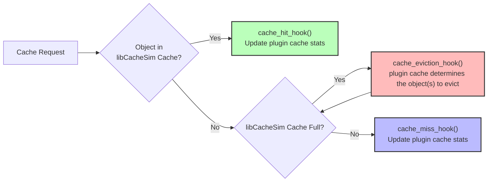

## 1. How the Plugin System Works

A series of hook functions defines the behavior of the custom cache during cache hits and misses. In essence, `libCacheSim` maintains a basic cache that tracks whether an object is a hit or miss, whether the cache is full, and provides hooks accordingly. The actual cache management logic—such as deciding which object(s) to evict on a miss—is entirely delegated to the plugin via these hooks.



libCacheSim supports two types of plugins:

### 1.1 C/C++ Plugins

`plugin_cache.c` ships with *libCacheSim* and delegates **all policy-specific logic** to a user-supplied shared library (``.so`` / ``.dylib``).  At run-time the library is

1. loaded with `dlopen()`;
2. each required *hook* is resolved with `dlsym()`; and
3. the hooks are invoked on cache hits, misses, evictions, and removals.

### 1.2 Python Plugins

The Python binding provides `PythonHookCachePolicy` which allows you to implement custom cache replacement algorithms using pure Python functions - **no C/C++ compilation required**. This is perfect for:
- Prototyping new cache algorithms
- Educational purposes and learning
- Research and experimentation
- Custom business logic implementation

Because plugins are completely decoupled from core code you can:
* experiment with new algorithms quickly,
* write plugins in **C, C++, or Python**, and
* distribute them independently from *libCacheSim*.

---

## 2. C/C++ Plugin Development

> [!IMPORTANT]
> Before we start, make sure you have followed [Build and Install libCacheSim](https://github.com/1a1a11a/libCacheSim/blob/develop/README.md#build-and-install-libcachesim) to build the core *libCacheSim* library.

### 2.1 Required Hook Functions

Your library **must** export the following C-symbols:

| Hook | Prototype | Called When |
|------|-----------|-------------|
| `cache_init_hook` | `void *cache_init_hook(const common_cache_params_t ccache_params);` | Once at cache creation. Return an opaque pointer to plugin state. |
| `cache_hit_hook` | `void cache_hit_hook(void *data, const request_t *req);` | A requested object is found in the cache. |
| `cache_miss_hook` | `void cache_miss_hook(void *data, const request_t *req);` | A requested object is **not** in the cache *after* insertion. |
| `cache_eviction_hook` | `obj_id_t cache_eviction_hook(void *data, const request_t *req);` | Cache is full – must return the object-ID to evict. |
| `cache_remove_hook` | `void cache_remove_hook(void *data, obj_id_t obj_id);` | An object is explicitly removed (not necessarily due to eviction). |
| `cache_free_hook` | `void cache_free_hook(void *data);` | Plugin resources can be freed. |

**Notes**
1. The opaque pointer returned by `cache_init_hook` is passed back to every other hook via the `data` parameter, letting your plugin maintain arbitrary state (linked lists, hash maps, statistics, etc).
2. The `cache_free_hook` is optional but recommended for memory safety.

### 2.2 Minimal Plugin Skeleton (C++)

Below is a minimal FIFO plugin implementation in C++. You can follow this guide as a starting point for your own policy. Create a new file at `plugins/plugin_fifo.cpp` (you need to create the parent directory as well) and paste the following code:

```cpp
#include <libCacheSim.h>

#include <deque>

class FifoCache {
 private:
  std::deque<obj_id_t> queue_;
  uint64_t cache_size_;

 public:
  FifoCache(uint64_t cache_size) : cache_size_(cache_size) {}

  void on_hit(obj_id_t id) {}

  void on_miss(obj_id_t id, uint64_t size) {
    if (size <= cache_size_) {
      queue_.push_back(id);
    }
  }

  obj_id_t evict() {
    if (queue_.empty()) {
      return 0;
    }
    obj_id_t victim = queue_.front();
    queue_.pop_front();
    return victim;
  }

  void on_remove(obj_id_t id) {
    for (auto it = queue_.begin(); it != queue_.end(); ++it) {
      if (*it == id) {
        queue_.erase(it);
        break;
      }
    }
  }
};

extern "C" {
void *cache_init_hook(const common_cache_params_t params) {
  return new FifoCache(params.cache_size);
}

void cache_hit_hook(void *data, const request_t *req) {
  static_cast<FifoCache *>(data)->on_hit(req->obj_id);
}

void cache_miss_hook(void *data, const request_t *req) {
  static_cast<FifoCache *>(data)->on_miss(req->obj_id, req->obj_size);
}

obj_id_t cache_eviction_hook(void *data, const request_t * /*req*/) {
  return static_cast<FifoCache *>(data)->evict();
}

void cache_remove_hook(void *data, obj_id_t obj_id) {
  static_cast<FifoCache *>(data)->on_remove(obj_id);
}

void cache_free_hook(void *data) {
  FifoCache *fifo_cache = (FifoCache *)data;
  delete fifo_cache;
}
}  // extern "C"
```

**Notes**
1. The plugin can allocate dynamic memory; it will live until the cache is destroyed.
2. Thread safety is up to you - core *libCacheSim* is single-threaded today.
3. Remember to check if objects can fit in the cache before adding them to your data structure in `cache_miss_hook`. Objects larger than the cache size are never inserted into the internal cache, but the hook is still called.

### 2.3 Building the Plugin

We will use CMake to build the plugin (though any build system that can produce a shared library with the required symbols will work). Create a `CMakeLists.txt` in the `plugins/` directory with the following content:

```cmake
cmake_minimum_required(VERSION 3.12)
project(plugins CXX C)

find_package(PkgConfig REQUIRED)
pkg_check_modules(GLIB REQUIRED glib-2.0)

set(PLUGINS fifo)  # Add more plugins here when you create them

foreach(plugin IN LISTS PLUGINS)
  add_library(plugin_${plugin} SHARED plugin_${plugin}.cpp)

  target_include_directories(plugin_${plugin} PRIVATE
    ${CMAKE_CURRENT_SOURCE_DIR}/../libCacheSim/include
    ${GLIB_INCLUDE_DIRS})

  set_target_properties(plugin_${plugin} PROPERTIES
    OUTPUT_NAME "plugin_${plugin}_hooks")
endforeach()
```

Make sure you are currently in the `plugins/` directory. To build your plugin(s), run the following commands:

```bash
mkdir -p build && cd build/
cmake -G Ninja .. && ninja
```

This will produce `libplugin_fifo_hooks.so` in the `plugins/build/` directory (or `libplugin_fifo_hooks.dylib` on macOS).

### 2.4 Using the C/C++ Plugin with `cachesim`

If you are in the `plugins/build/` directory, you can run `cachesim` with your plugin like this:

```bash
../../_build/bin/cachesim ../../data/cloudPhysicsIO.vscsi vscsi pluginCache 1MB \
  -e "plugin_path=libplugin_fifo_hooks.so"
```

If you are in other directories, adjust the paths accordingly.

Keys after `-e` are comma-separated. The supported keys today are:
* `plugin_path` (required) – absolute or relative path to the `.so` / `.dylib`.
* `cache_name` (optional) – override the cache's display name. If not provided, the runtime will default to `pluginCache-<fileName>` for easier identification in logs.
* `print` – debug helper: print current parameters and exit.

For more information, check `-?/--help` of `libcachesim`:

```bash
../../_build/bin/cachesim --help
```

---

## 3. Python Plugin Development

> [!IMPORTANT]
> Before we start, make sure you have installed the Python binding:
> ```bash
> pip3 install libcachesim
> ```

### 3.1 Required Hook Functions

Your Python plugin **must** implement the following callback functions:

| Hook | Prototype | Called When |
|------|-----------|-------------|
| `cache_init_hook` | `cache_init_hook(common_cache_params: CommonCacheParams) -> Any` | Once at cache creation. Return an opaque object to maintain plugin state. |
| `cache_hit_hook` | `cache_hit_hook(data: Any, req: Request) -> None` | A requested object is found in the cache. |
| `cache_miss_hook` | `cache_miss_hook(data: Any, req: Request) -> None` | A requested object is **not** in the cache *after* insertion. |
| `cache_eviction_hook` | `cache_eviction_hook(data: Any, req: Request) -> int` | Cache is full – must return the object-ID to evict. |
| `cache_remove_hook` | `cache_remove_hook(data: Any, obj_id: int) -> None` | An object is explicitly removed (not necessarily due to eviction). |
| `cache_free_hook` | `cache_free_hook(data: Any) -> None` | Plugin resources can be freed. |

**Notes**
1. The opaque object returned by `cache_init_hook` is passed back to every other hook via the `data` parameter, letting your plugin maintain arbitrary state (lists, dicts, custom classes, etc). You can replace `Any` with the actual type of your state to get better type hints.
2. The `cache_free_hook` is optionally but recommended.

### 3.2 Minimal Plugin Skeleton (Python)

Below is a minimal FIFO plugin implementation in Python. You can follow this guide as a starting point for your own policy. Create a new file `plugins/plugin_fifo.py` and paste the following code:

```python
from collections import deque
from libcachesim import CommonCacheParams, Request


class FifoCache:
    def __init__(self, cache_size: int):
        self.queue = deque()
        self.cache_size = cache_size

    def on_hit(self, req: Request):
        pass  # FIFO doesn't reorder on hit

    def on_miss(self, req: Request):
        if req.obj_size <= self.cache_size:
            self.queue.append(req.obj_id)

    def evict(self, req: Request):
        if not self.queue:
            return 0
        return self.queue.popleft()

    def on_remove(self, obj_id: int):
        try:
            self.queue.remove(obj_id)
        except ValueError:
            pass  # Object not in queue


def cache_init_hook(common_cache_params: CommonCacheParams):
    return FifoCache(common_cache_params.cache_size)


def cache_hit_hook(data: FifoCache, req: Request):
    data.on_hit(req)


def cache_miss_hook(data: FifoCache, req: Request):
    data.on_miss(req)


def cache_eviction_hook(data: FifoCache, req: Request):
    return data.evict(req)


def cache_remove_hook(data: FifoCache, obj_id: int):
    data.on_remove(obj_id)


def cache_free_hook(data: FifoCache):
    data.queue.clear()
```

### 3.3 Using the Python Plugin

There is no build step required for Python plugins. You can use your plugin directly in the same Python script. For instance, you can add the following content after the plugin we just created:

```python
if __name__ == "__main__":
    from pathlib import Path
    from libcachesim import PluginCache, TraceReader, TraceType

    plugin_fifo_cache = PluginCache(
        cache_size=1024 * 1024,  # 1 MB
        cache_init_hook=cache_init_hook,
        cache_hit_hook=cache_hit_hook,
        cache_miss_hook=cache_miss_hook,
        cache_eviction_hook=cache_eviction_hook,
        cache_remove_hook=cache_remove_hook,
        cache_free_hook=cache_free_hook,
        cache_name="fifo",
    )

    trace = Path(__file__).parent.parent / "data" / "cloudPhysicsIO.vscsi"
    reader = TraceReader(trace=str(trace), trace_type=TraceType.VSCSI_TRACE)

    req_miss_ratio, byte_miss_ratio = plugin_fifo_cache.process_trace(reader)
    print(f"Request miss ratio: {req_miss_ratio:.4f}")
    print(f"Byte miss ratio: {byte_miss_ratio:.4f}")
```

Then simply run this script with `python3`.

---

## 4. More Examples

- C/C++: See [example/plugin_v2/](https://github.com/1a1a11a/libCacheSim/tree/develop/example/plugin_v2/) for a more comprehensive example.
- Python: See the [libCacheSim-python](https://github.com/cacheMon/libCacheSim-python/tree/main/examples) repository for more examples.

---

## 5. Troubleshooting

### C/C++ Plugin Issues

* **Plugin not found?** Verify the path passed via `plugin_path=` is correct, you may want to use absolute path.
* **Missing symbols?** Make sure the function names exactly match the prototypes above and are declared `extern "C"` when compiling as C++.
* **Link-time errors?** Pass the same architecture flags (`-m64`, etc.) that *libCacheSim* was built with.
* **Runtime crash inside plugin?** Use `gdb -ex r --args cachesim ...` and place breakpoints in your hook functions.

### Python Plugin Issues

* **Performance Issues**: Use `process_trace()` for large workloads instead of individual `get()` calls for better performance.
* **Memory Usage**: Monitor cache statistics (`cache.get_occupied_byte()`) and ensure proper cache size limits for your system.
* **Custom Cache Issues**: Validate your custom implementation against built-in algorithms using test functions.
* **Implementation Issues**: When re-implementing an eviction algorithm in libCacheSim using the plugin system, note that the core hook functions are simplified. This may introduce some challenges. The central function for cache simulation is `get` and its common internal logic is:

  ```mermaid
  graph LR
      C["find() (Cache state is updated automatically, since update_cache = true by default)"] --> D{Found in cache?}
      D -->|Yes| E["cache_hit_hook()"]
      D -->|No| F{"Cache full?"}
      F -->|"Yes (no space for new object)"| G["cache_eviction_hook()"]
      F -->|No| H["cache_miss_hook()"]
      G --> F

      style E fill:#bfb,stroke:#333,stroke-width:2px
      style G fill:#fbb,stroke:#333,stroke-width:2px
      style H fill:#bbf,stroke:#333,stroke-width:2px
  ```

  Because find is not exposed to plugins, any state-update logic that normally happens inside find must instead be implemented inside the relevant hook functions (`cache_hit_hook`, `cache_eviction_hook`, or `cache_miss_hook`) according to your algorithm's needs.
